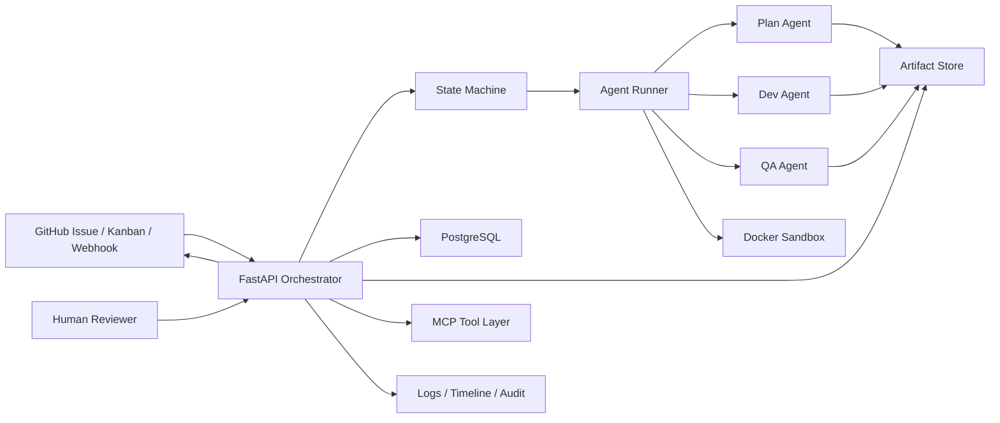
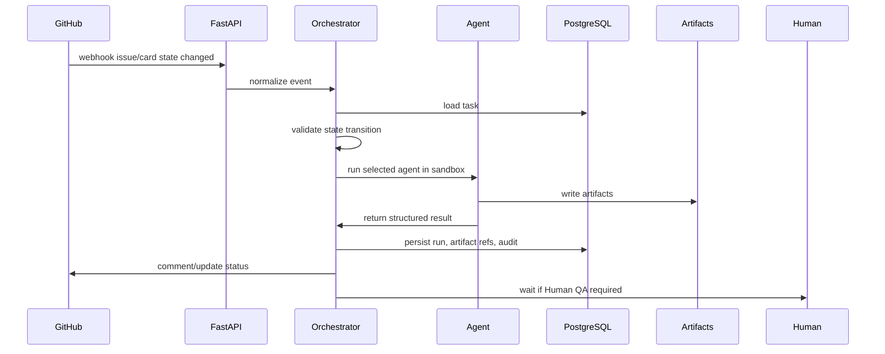

# ai-harness Architecture

## 1. Overall System Architecture



The orchestrator owns workflow state. Agents only produce artifacts and proposed next actions. The orchestrator validates transitions, persists results, and requires human approval before `Done`.

## 2. Directory Structure

```text
ai-harness/
├── orchestrator/
│   ├── api/
│   ├── core/
│   ├── db/
│   └── services/
├── agents/
├── prompts/
├── workflows/
├── rules/
├── sandbox/
├── mcp/
├── memory/
├── artifacts/
├── logs/
├── tests/
└── docs/
```

## 3. Workflow / State Machine Design

States:

| State | Meaning | Owner |
|---|---|---|
| `Backlog` | Idea or rough requirement | Human |
| `Plan Review` | Plan Agent finished; human reviews the plan | Human |
| `Dev Ready` | Plan approved; Dev Agent can run | Human / Codex |
| `Dev Review` | Dev Agent finished; human reviews implementation | Human |
| `QA Ready` | Dev approved; QA Agent can run | Human / Codex |
| `QA Review` | QA Agent finished; human reviews QA result | Human |
| `Ready To Deploy` | QA approved; deploy can be approved | Human |
| `Done` | Completed and approved | Human |

Allowed transitions:

```text
Backlog -> Plan Review
Plan Review -> Dev Ready
Dev Ready -> Dev Review
Dev Review -> QA Ready
QA Ready -> QA Review
QA Review -> Ready To Deploy
Ready To Deploy -> Done
```

Rules:

- `Backlog -> Plan Review` is produced by Plan Agent.
- `Plan Review -> Dev Ready` requires human plan approval.
- `Dev Ready -> Dev Review` is produced by Dev Agent.
- `Dev Review -> QA Ready` requires human dev approval.
- `QA Ready -> QA Review` is produced by QA Agent.
- `QA Review -> Ready To Deploy` requires human QA approval.
- `Ready To Deploy -> Done` requires explicit deploy approval.
- Direct agent-to-agent progression without a human approval gate is forbidden.

## 4. Agent Abstraction Design

Agents implement one interface:

```text
AgentRunner.run(input) -> AgentResult
```

Agent input contains:

- task id
- GitHub issue snapshot
- current state
- scoped artifacts
- summarized memory
- project rules
- execution limits

Agent result contains:

- status: `success`, `failed`, `needs_human`, `retryable_failed`
- artifacts
- summary
- next suggested state
- logs and metrics

Agents must not mutate workflow state directly.

## 5. Orchestration Structure

The orchestrator handles:

1. Receive GitHub webhook or manual API event
2. Load current task and state
3. Validate event and transition
4. Build task-scoped context
5. Run the correct agent in sandbox
6. Persist artifacts, timeline, audit rows
7. Apply next state if transition rules allow it
8. Stop for human input where required

## 6. Sandbox Structure

Agent execution should run in an isolated workspace:

```text
base repo clone
-> temporary worktree
-> docker container
-> resource limits
-> command timeout
-> collect artifacts
-> cleanup
```

Sandbox requirements:

- temporary execution directory
- no shared mutable state except mounted task workspace
- configurable CPU/memory/time limits
- cleanup after success/failure
- logs and exit codes always collected

## 7. DB Schema

Core tables:

- `tasks`: GitHub issue mapped to workflow task
- `runs`: one agent execution attempt
- `artifacts`: generated files and metadata
- `state_transitions`: state history
- `audit_logs`: append-only human/system event log

See `docs/db-schema.md` for detailed schema.

## 8. Event Flow



## 9. MVP Scope

MVP includes:

- manual event API
- state machine
- Plan/Dev/QA placeholder agents
- artifact persistence on local filesystem
- PostgreSQL schema via SQLAlchemy
- retry limit and timeout fields
- structured logs
- Docker compose
- pytest workflow checks

MVP excludes:

- automatic GitHub Projects mutation
- real OpenAI calls
- real Docker container execution
- production auth
- multi-tenant permissions

## 10. Bootstrap Code

Bootstrap code lives in:

- `orchestrator/main.py`
- `orchestrator/api/routes.py`
- `orchestrator/services/orchestration.py`
- `agents/base.py`
- `workflows/state_machine.py`

## 11. FastAPI Server Structure

Endpoints:

- `GET /health`
- `POST /events/manual`
- `POST /tasks`
- `GET /tasks/{task_id}`
- `POST /tasks/{task_id}/approve-human-qa`

GitHub webhook support will be added under `POST /webhooks/github` after signature verification is configured.

## 12. Docker Compose

`docker-compose.yml` runs:

- `postgres`
- `api`

The API uses `DATABASE_URL` and writes artifacts to `/app/artifacts`.

## 13. Logging Strategy

All logs should be structured JSON with:

- timestamp
- level
- task id
- run id
- agent name
- state
- event type
- message

Human-readable summaries belong in artifacts, not only logs.

## 14. Retry / Recovery Strategy

Retry is per task and per state:

- Plan Agent failure: stop and request human clarification
- Dev Agent failure: retry while below limit, otherwise stop
- QA Agent failure: transition back to `Dev Ready` while below limit
- Crash recovery: resume from persisted task state and last completed run

Agent output must be idempotent. Re-running an agent should create a new run and artifact version, not overwrite prior evidence.

## 15. Observability Strategy

Observability surfaces:

- task timeline
- run history
- retry history
- state transition history
- artifact index
- failure reason and stack trace
- final human approval record

The system should make it possible to answer: who or what moved the task, why, based on which artifact, and with what validation result.
