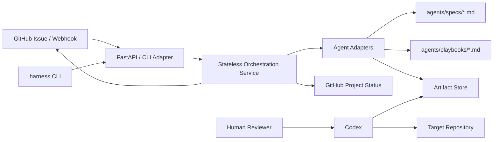

# ai-harness Architecture

## 1. Overall System Architecture



The orchestrator does not own long-lived workflow state.
Each command builds issue context, runs the selected agent adapter, and writes deterministic artifacts under `artifacts/issue-{number}/...`.

## 2. Directory Structure

```text
ai_harness/    CLI entrypoint
orchestrator/  Stateless API, settings, service adapters
agents/        Agent adapters, Markdown specs, Codex playbooks
artifacts/     Issue-scoped generated context and handoff files
docs/          Architecture and operations docs
tests/         pytest suite
```

## 3. Agent Model

Agents implement a small Python adapter interface:

```text
agent.run(AgentInput) -> AgentResult
```

The adapter may read Markdown specs/playbooks and create artifacts.
It must not pretend to complete implementation or QA that Codex has not actually performed.

## 4. Artifact Contract

Each issue uses:

```text
artifacts/issue-{number}/
  context/
  design/
  dev/
  qa/
  documentation/
  approvals/
```

Artifacts are the handoff boundary between the harness and Codex.
They should be short, explicit, and useful to the next worker.

## 5. CLI And Webhook Responsibilities

CLI and GitHub webhook handlers are intentionally thin.

- fetch GitHub issue context
- infer issue type labels when possible
- call the selected agent adapter
- write artifact paths into the result
- optionally leave generated GitHub comments

They do not perform autonomous app implementation.
When GitHub Project configuration exists, they move only the Project Status field for the current issue.

## 6. Codex Responsibilities

Codex reads the issue, artifacts, and playbooks, then performs the actual work:

- branch checkout/creation
- file edits
- tests and local validation
- browser/API/log verification
- report writing
- commit and push

## 7. Human Gates

Human approval is now an artifact record, not a persisted state transition.
Use:

```bash
harness approve --issue 13 --stage plan --approved-by rsy
harness approve --issue 13 --stage dev --approved-by rsy
harness approve --issue 13 --stage qa --approved-by rsy
```

Codex and the human operator decide whether to proceed based on artifacts and actual verification results.

## 8. Observability

The main observability surface is the artifact tree.
`harness status --issue <number>` summarizes the issue context, generated stages, approvals, and next likely action.

Logs remain useful for command failures, but human-readable decisions belong in artifacts.
Project Status sync results are written under `artifacts/issue-{number}/project-status/`.
